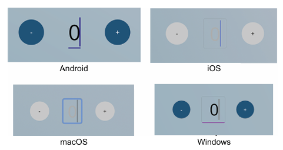

# FlagstoneUI

<div align="center">
  
  <h1>FlagstoneUI</h1>
  <h3>True cross‑platform UI for .NET MAUI — one control surface, consistent behaviour everywhere, no platform code.</h3>
</div>

FlagstoneUI removes the last barrier to building visually consistent .NET MAUI apps.    

.NET MAUI gets you most of the way there, but as soon as you need a custom border, corner radius, or background on a text input, you fall through a gap, and end up in platform handlers for iOS, Android, and Windows.

**FlagstoneUI closes those gaps.**
It gives you enhanced, neutral controls designed for full visual control from shared code. No renderers. No handlers. No platform quirks. Just the UI your app is meant to have, working the same on every device.

> **⚠️ Early experimental project.**
> Functional and ready for testing, but evolving quickly.

## What’s Available Now

* Core controls: `FsButton`, `FsEntry`, `FsCard`, `FsEditor`
* Token‑based theming system (colour, spacing, shapes, typography)
* Material theme (NuGet) + example themes in the sample app
* Community Toolkit integrations:

  * `ValidationBehaviorAdapter` for reuse of existing validators
  * Optional animated border behaviour for `FsEditor`

Themes are standard resource dictionaries — copy, customise, extend, or publish your own.


## Why FlagstoneUI?

### The gap in .NET MAUI

.NET MAUI’s default controls look native, and _relatively_ consistent, but many visual properties simply aren't exposed.

```xml
<Entry Placeholder="Email" />
```

Looks simple. But here's an example of how an `Entry` is rendered on each platform:



Now imagine your designer specifies:

* CornerRadius: 8
* BorderWidth: 2
* BorderColor: #2196F3

To implement that in .NET MAUI, you'll need **custom handler code for iOS, Android, and Windows**, and you'll maintain that code forever — including variants:

- Write a handler to modify `UITextField` for iOS and macOS (and understand what that means)
- Write a separate handler to modify `EditText` for Android (and understand _that_ platform's APIs)
- Write yet another handler to modify `TextBox` for Windows (and learn _those_ platform-specific details)
- Create variants for different styles (primary, secondary, different input purposes) _in each handler_
- Create variants for different states (focused, disabled, valid, invalid, error) _in each handler_
- Maintain all three handlers, forever, as platforms evolve and APIs change

### FlagstoneUI’s approach

FlagstoneUI gives you controls designed for full visual control from shared code.

```xml
<FsEntry
    Placeholder="Email"
    CornerRadius="8"
    BorderColor="#2196F3"
    BorderWidth="2" />
```

And you can use [explicit styles](https://learn.microsoft.com/dotnet/maui/user-interface/styles/xaml?view=net-maui-10.0#explicit-styles) for your variants and states, or [Visual State Manager](https://learn.microsoft.com/dotnet/maui/user-interface/visual-states?view=net-maui-10.0), all in .NET MAUI, without touching platform code.

One place. One API. Same behaviour everywhere.

This is the layer that makes .NET MAUI feel complete: define your visual system once, and your entire app uses it.

## Quick Start

**📚 [Documentation](docs/index.md)** | **🚀 [Quickstart](docs/getting-started/quickstart.md)**

### Build from Source

```bash
# Clone and explore
git clone https://github.com/matt-goldman/flagstone-ui.git
cd flagstone-ui

dotnet build

# Run sample app
dotnet run --project samples/FlagstoneUI.SampleApp
```

Or reference `FlagstoneUI.Core` in your MAUI project.

### Install via NuGet (Preview)

```bash
dotnet add package FlagstoneUI.Core --version 0.0.1-preview1

dotnet add package FlagstoneUI.Integrations.MCT --version 0.0.1-preview1

dotnet add package FlagstoneUI.Themes.Material --version 0.0.1-preview1
```

## What Does It Look Like?

```xml
<!-- Direct styling - this is FlagstoneUI core -->
<FsButton 
    Text="Click Me" 
    BackgroundColor="#6750A4" 
    CornerRadius="12" />

<!-- Theme-based styling with implicit styles -->
<FsButton Text="Submit" />  <!-- Uses implicit style from theme -->

<!-- Entry with validation -->
<FsEntry 
    Placeholder="Email"
    CornerRadius="8"
    BorderBrush="#2196F3"
    BorderWidth="2">
    <FsEntry.Behaviors>
        <ValidationBehaviorAdapter
            ValidStyle="{StaticResource ValidStyle}"
            InvalidStyle="{StaticResource InvalidStyle}"
            Behavior="{EmailValidationBehavior}"
            Flags="ValidateOnValueChanged" />
    </FsEntry.Behaviors>
</FsEntry>

<!-- Card container -->
<FsCard
    BackgroundColor="#FAFAFA"
    CornerRadius="12"
    Padding="16">
    <Label Text="Card Content" />
</FsCard>
```

If not using implicit/global namespaces, prefix controls as:
`<fs:FsButton>...</fs:FsButton>`

## How It Works

1. **Enhanced Controls**
   Purpose‑built controls that expose full visual control from shared code.

2. **Standard .NET MAUI Styling**
   Use inline values, explicit styles, implicit styles, or `StaticResource`/`DynamicResource` — all valid approaches.

3. **Themes**
   Resource dictionaries that apply consistent design across your app.

4. **Flexibility**
   Use direct values for simple cases, app resources for reusability, or design tokens for consistency — choose what fits your project.

## Development Status

### Available

* `FsButton`, `FsEntry`, `FsCard`, `FsEditor`
* Unified styling plane for .NET MAUI
* Material theme (example implementation)
* Sample app with multiple theme examples
* Community Toolkit integration
* Full documentation

### Coming Soon

* Additional controls (labels, lists, navigation)
* More theme examples
* Theme conversion tools

See the [roadmap](docs/project/roadmap.md).

## Project Structure

```text
flagstone-ui/
├── src/
│   ├── FlagstoneUI.Core/              # Core controls + styling surface
│   ├── FlagstoneUI.Themes.Material/   # Material theme example
│   └── FlagstoneUI.Blocks/            # Planned: reusable UI building blocks
├── samples/
│   ├── FlagstoneUI.SampleApp/         # Showcase
│   └── FlagstoneUI.ThemePlayground/   # Theme experimentation
├── docs/                              # Documentation
└── tools/                             # Theme converters and utilities
```

The **Blocks** project (planned) will offer prebuilt forms, layouts, and workflows — optional extensions built on FlagstoneUI controls.

## Contributing

This project is still early — **your feedback genuinely shapes its direction**.

Most important of all:
**Tell me whether this is useful, or if you think the entire idea is misguided.**
Honest critique is just as valuable as enthusiasm.

### Ways to help

* Try the sample apps and share what worked (or didn’t)
* Tell me *why* you would or wouldn’t use this
* Report bugs or suggest features
* Submit PRs
* Create and publish themes
* Improve documentation

Open a [Discussion](../../discussions) or reach out to [@matt-goldman](https://github.com/matt-goldman).

**License:** MIT
**Status:** Experimental
**Compatibility:** .NET 10 + MAUI
