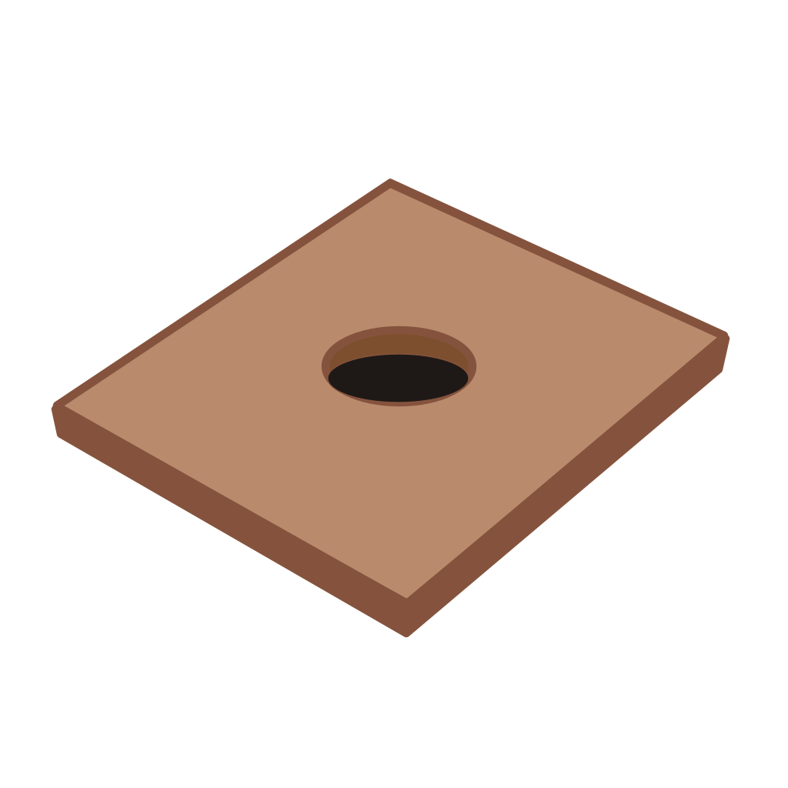

<div align="center">
  
  <h1>FlagstoneUI</h1>
  <p><strong>Complete visual control over .NET MAUI apps—no platform-specific code required</strong></p>
</div>

.NET MAUI gives you cross-platform UI, but many visual properties—borders, corner radius, background colors on inputs—require custom handlers for each platform. **FlagstoneUI changes that.**

Get full control over how your app looks, with simple properties that work everywhere, that you can style in XAML or C#. Create consistent, themeable designs without touching platform-specific code. Change your entire app's appearance by swapping a single theme file.

> **⚠️ Note:** This is an early experimental project. It's functional and available for testing, but expect changes as it evolves.


## What's Available Now

* Four core controls: `FsButton`, `FsEntry`, `FsCard`, `FsEditor`
* Material theme `*`
* .NET MAUI Community Toolkit integration
    - `ValidationBehaviorAdapter`: Let's you re-use validators from the CommunityToolkit with FlagstoneUI input controls (`FsEntry` and `FsEditor`). See example implementation in the sample app.
    - Border animation for `FsEditor`. This is mostly just for fun and was used to create the `AiEditor` in the sample app. But you could easily adapt this for your own use case.

`*` Note that there are several themes included in the sample app. You can use these in your apps too if you wish, just copy the code. Themes are just resource dictionaries so you can just copy them into your own app. However the Material theme is the only one available as a NuGet package at this time. ALSO: feel free to create and share your own themes!

## Quick Start

**📚 [Full Documentation & Guides](docs/README.md)** | **🚀 [Quickstart Guide](docs/quickstart.md)**

This is still a very early prototype but you can start playing with it now.

### Build from Source

```bash
# Clone and explore
git clone https://github.com/matt-goldman/flagstone-ui.git
cd flagstone-ui

# Run the sample app (requires .NET 10 SDK + MAUI workload)
dotnet build
dotnet run --project samples/FlagstoneUI.SampleApp
```

Or reference the `FlagstoneUI.Core` project in your own MAUI app to start theming your controls.

### NuGet Package (Preview)

```bash
# Install FlagstoneUI Core package
dotnet add package FlagstoneUI.Core --version 0.0.1-preview1

# (Optional) Install MAUI Community Toolkit integration package
dotnet add package FlagstoneUI.Integrations.MCT --version 0.0.1-preview1

# (Optional) Install Material theme package
dotnet add package FlagstoneUI.Themes.Material --version 0.0.1-preview1
```

## What Does It Look Like?

```xml
<!-- Simple themed button with consistent styling across platforms -->
<FsButton
    Text="Click Me"
    BackgroundColor="{DynamicResource Color.Primary}"
    CornerRadius="{DynamicResource Shape.CornerRadius.Medium}" />

<!-- Themed text entry with validation (using Community Toolkit) -->
<FsEntry
    Placeholder="Enter email"
    BackgroundColor="{DynamicResource Color.Surface}"
    BorderColor="{DynamicResource Color.Border}">
    <FsEntry.Behaviors>
          <ValidationBehaviorAdapter ValidStyle="{StaticResource ValidStyle}"
                                     InvalidStyle="{StaticResource InvalidStyle}"
                                     Behavior="{EmailValidationBehavior}"
                                     Flags="ValidateOnValueChanged" />
        </FsEntry.Behaviors>
</FsEntry>

<!-- Card container with theme tokens -->
<FsCard
    BackgroundColor="{DynamicResource Color.Surface}"
    CornerRadius="{DynamicResource Shape.CornerRadius.Large}"
    Padding="{DynamicResource Spacing.Medium}">
    <Label Text="Card Content" />
</FsCard>
```

**Note:** Above assumes you're using [XAML global and implicit namespaces](https://learn.microsoft.com/dotnet/maui/whats-new/dotnet-10?view=net-maui-10.0#implicit-and-global-xml-namespaces). Without that you would consume these with a namespace prefix like `<fs:FsButton>...</fs:FsButton>`.

## How It Works

1. **Enhanced Controls** → Use `FsButton`, `FsEntry`, `FsCard`, etc. with full visual property control
2. **Design Tokens** → Define your design system once (colors, spacing, typography, shapes)
3. **Theme Files** → Apply consistent styling across your app with XAML resource dictionaries
4. **Swap Themes** → Change your entire app's look by switching theme files

## Why FlagstoneUI?

**The challenge:** Many visual properties aren't exposed in the .NET MAUI API. For example, for a colored border on a text input you'll need custom handlers for iOS, Android, and Windows, each with platform-specific code.

**Flagstone's solution:** Enhanced controls that expose these properties as simple XAML attributes. Write once, works everywhere.

**Example:**

```xml
<!-- Traditional MAUI: requires custom handlers for each platform -->
<Entry Placeholder="Email" />
<!-- + C# handler code for iOS UITextField styling -->
<!-- + C# handler code for Android EditText styling -->
<!-- + C# handler code for Windows styling -->

<!-- Flagstone: works everywhere out of the box -->
<FsEntry
    Placeholder="Email"
    CornerRadius="8"
    BorderColor="#2196F3"
    BorderWidth="2" />
```

**Bonus:** Theme your entire app with design tokens—like Bootstrap's approach to theming, but for native mobile apps. Change colors, spacing, and typography across your whole app by swapping one theme file.

**Pairs perfectly with [MAUI Community Toolkit](https://github.com/CommunityToolkit/Maui)** - FlagstoneUI handles visual styling, MCT provides behaviors and converters.

**Learn more:** [Architecture](docs/architecture.md) | [Roadmap](docs/roadmap.md)

## Development Status

**Available now:**
- ✅ Four core controls: `FsButton`, `FsEntry`, `FsCard`, `FsEditor`
- ✅ Token-based theming system
- ✅ Material theme + sample app with theme variations
- ✅ MAUI Community Toolkit integration
- ✅ [Complete documentation](docs/README.md)

**Coming soon:**
- Additional controls (labels, lists, navigation)
- Theme conversion tools (Bootstrap CSS → Flagstone themes)
- AI-powered theme generation

See the [roadmap](docs/roadmap.md) for details.

## Project Structure

```
flagstone-ui/
├── src/
│   ├── FlagstoneUI.Core/          # Core controls and token system
│   ├── FlagstoneUI.Themes.Material/ # Material theme
│   └── FlagstoneUI.Blocks/        # Reusable app screens (planned for MVP)
├── samples/
│   ├── FlagstoneUI.SampleApp/     # Main showcase app
│   └── FlagstoneUI.ThemePlayground/ # Theme experimentation
├── docs/                          # 📚 Complete documentation
└── tools/                         # AI tooling & converters
```

**Note**: The Blocks (in progress) project will contain common UI building blocks (signup/signin forms, basic CRUD, etc.) and is planned as an extension for the MVP milestone. Currently at POC stage.

## Contributing

**This is an early experiment - feedback is gold!** 🙏

Most important: **Is this useful?** Tell me if you'd use it (or why you wouldn't). This helps validate the project direction.

**Ways to help:**
- 💬 Try the samples and share feedback (Issues welcome!)
- 🐛 Report bugs or suggest features
- 💻 Submit PRs (bug fixes, docs, new controls)
- 🎨 Create and share themes
- 📖 Improve documentation

**Questions?** Open a [Discussion](../../discussions) or ping [@matt-goldman](https://github.com/matt-goldman)

---

**License:** MIT | **Status:** Experimental POC | **Compatibility:** .NET 10 + MAUI
